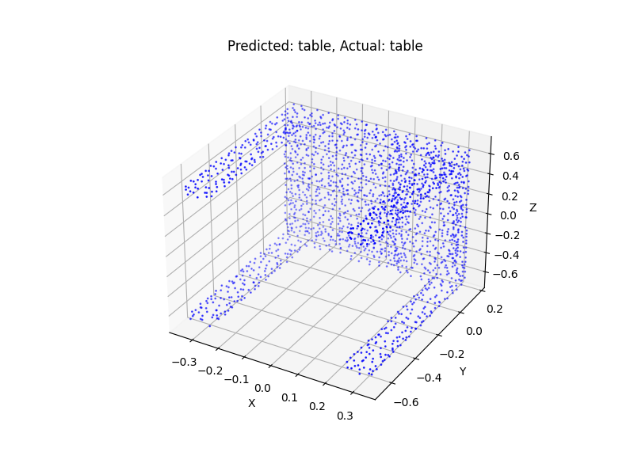

# PointNet 3D Point Cloud Classification

English / [中文](readme_zh.md)

↑ 点击切换语言

This project utilizes the **PointNet** framework, combining 3D spatial transformation networks (STN) with convolutional neural networks to enhance the quality of 3D point cloud classification, achieving precise categorization of 3D objects.

The image below shows the classification result of a point cloud sample by the model.



The image below illustrates the trend of training loss over the course of model training.


## Table of Contents

- [Multilingual Annotations](#multilingual-annotations)
- [Dataset](#dataset)
- [File Structure](#file-structure)
- [License](#license)
- [Contributions](#contributions)

## Multilingual Annotations

To facilitate understanding for developers from diverse language backgrounds, this project provides code comments in both English and Chinese.

## Dataset

The ModelNet40 dataset used in this project is a pre-processed version in HDF5 format, available from [GitHub](https://github.com/antao97/PointCloudDatasets).

## File Structure

The file structure of the project is as follows:

```c++
3D_Classification/
│
├── data/ 
│   └── modelnet40_hdf5_2048 (to be downloaded separately)
│
├── model/ 
│   └── model.pt
│
├── utils(en/zh)/
│   ├── dataloader.py
│   ├── pointnet.py
│   ├── stn3d.py
│   ├── test.ipynb
│   └── train.py
│
├── test.png
├── loss_plot.ipynb
├── loss_plot.png
├── train.csv
├── readme.md
└── main.py 
```

## License

This project uses the MIT license. For details, please refer to the [LICENSE](LICENSE) file.

## Contributions

All forms of contributions are welcome! Whether you report a bug or propose an idea, it is greatly appreciated!!

