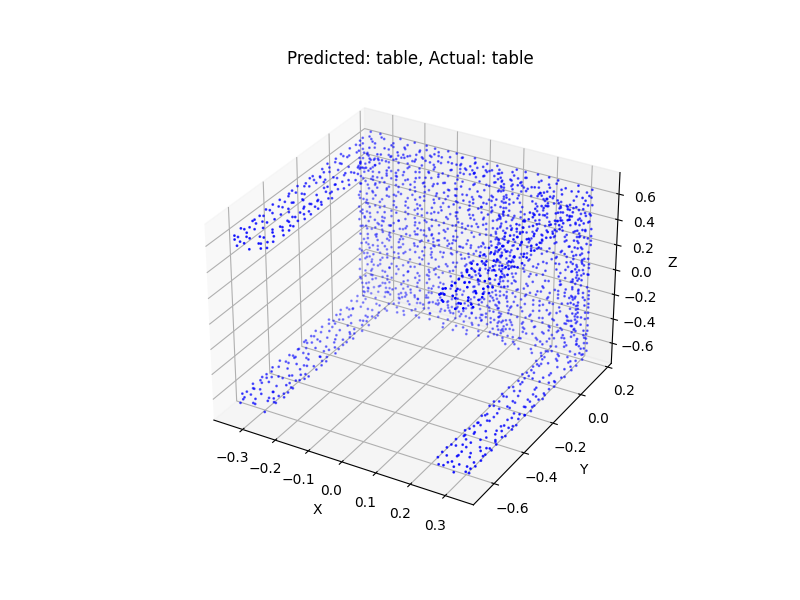
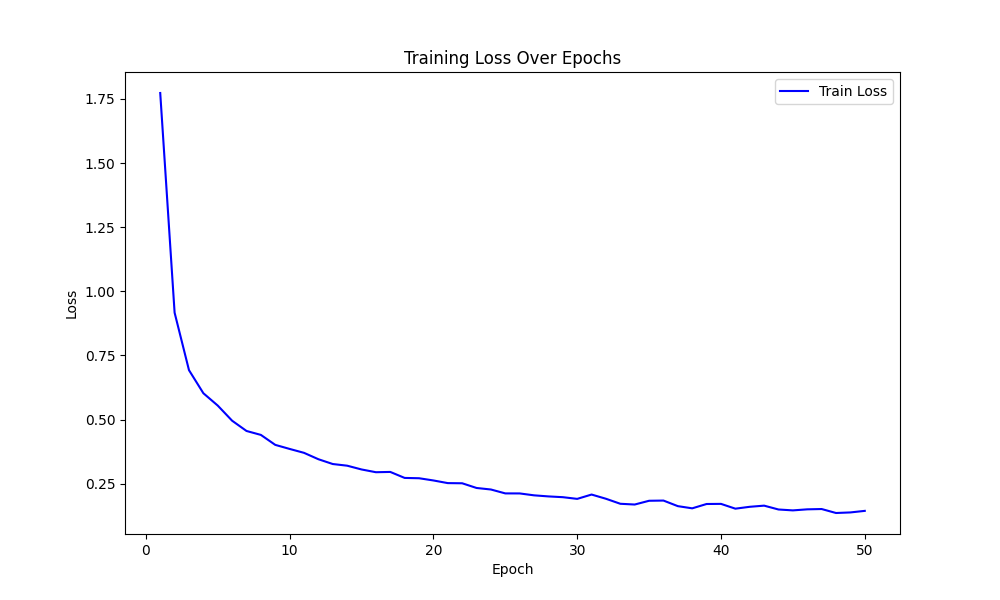

# PointNet 3D点云分类

[English](readme_zh)  /  中文

↑ Click the link above to switch languages

本项目通过 **PointNet** 框架 使用三维空间变换网络STN和卷积神经网络 提升三维点云分类质量 以实现对三维物体的精确分类

下图展示了模型对一个点云样本的分类结果



下图展示了该模型在训练过程中训练损失的变化趋势



## 目录

- [多语言注释](#多语言注释)
- [数据集](#数据集)
- [文件结构](#文件结构)
- [许可证](#许可证)
- [贡献](#贡献)

## 多语言注释

为了让不同语言背景的开发者更容易理解代码 本项目的注释提供了英文和中文两种版本

## 数据集

本项目使用的ModelNet40数据集是经过处理并保存为hdf5格式的版本 来源于[GitHub](https://github.com/antao97/PointCloudDatasets)

## 文件结构

项目的文件结构如下

```c++
3D_Classification/
│
├── data/ 
│   └── modelnet40_hdf5_2048 (自行下载)
│
├── model/ 
│   └── model.pt
│
├── utils(en/zh)/
│   ├── dataloader.py
│   ├── pointnet.py
│   ├── stn3d.py
│   ├── test.ipynb
│   └── train.py
│
├── test.png
├── loss_plot.ipynb
├── loss_plot.png
├── train.csv
├── readme.md
└── main.py 
```

## 许可证

本项目使用 MIT 许可证。有关详细信息，请参阅 [LICENSE](LICENSE) 文件。

## 贡献

欢迎所有形式的贡献！无论是报告错误还是提出建议 非常感谢！！